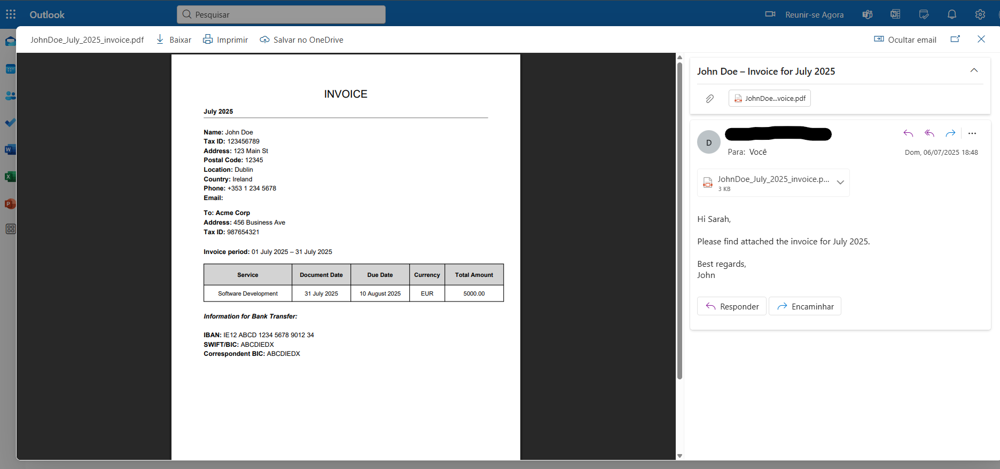
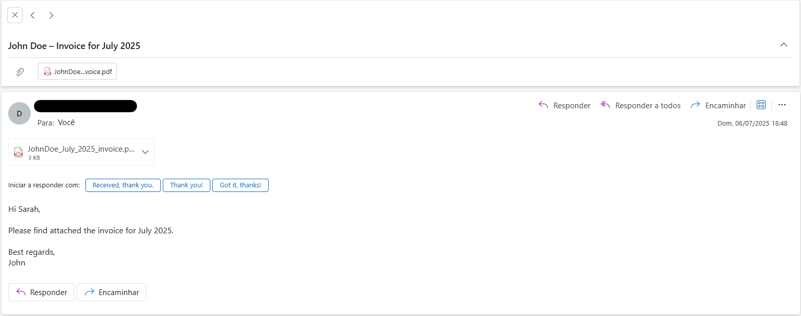

# Invoice Generator

**Personal Project Disclaimer**: I created this for my own monthly billing needs and decided to share it publicly in case it helps other freelancers and consultants. If you are interested in using this and run into any issues with the setup, feel free to reach out! 

## 📋 Table of Contents

- [Overview](#overview)
- [Features](#features)
- [Invoice Preview](#invoice-preview)
- [Email Preview](#email-preview)
- [Prerequisites](#prerequisites)
- [Quick Start](#quick-start)
- [Configuration](#configuration)
- [Local Development](#local-development)
- [AWS Deployment](#aws-deployment)
- [Scheduling](#scheduling)
- [Project Structure](#project-structure)
- [Environment Variables](#environment-variables)
- [Troubleshooting](#troubleshooting)


## 🎯 Overview

This system automatically generates PDF invoices and sends them via email on the last day of each month. It's designed for freelancers, consultants, and service providers who need reliable monthly billing automation.

The system can run locally for testing or be deployed to AWS Lambda for fully automated monthly execution.

## ✨ Features

- **Automated PDF Generation**: Creates professional invoices with your branding
- **Email Integration**: Sends invoices via Gmail SMTP with CC support
- **AWS Lambda Ready**: Deploy for serverless automation
- **Scheduled Execution**: Uses AWS EventBridge for monthly triggers
- **S3 Backup**: Optional invoice storage in AWS S3
- **Flexible Configuration**: Environment-based settings
- **Multi-timezone Support**: Handles DST automatically

## 📸 Invoice Preview

<!-- Replace this with your actual invoice screenshot -->


*Example of generated invoice layout with sender details, client information, service description, and payment details.*

## 📧 Email Preview

<!-- Replace this with your actual email screenshot -->


*Example of automated email with invoice attachment.*

## 🔧 Prerequisites


### AWS Deployment
- AWS CLI configured with appropriate permissions
- Docker installed
- AWS account with:
  - Lambda permissions
  - ECR (Elastic Container Registry) access
  - EventBridge Scheduler permissions
  - IAM role creation permissions
  - S3 access (if using backup feature)

### Email Setup
- Gmail account with App Password enabled
- Two-factor authentication enabled on Gmail

## 🚀 Quick Start

### 1. Clone the Repository

```bash
git clone git@github.com:DuartePombo/lambda_invoice_generator.git
cd lambda_invoice_generator
```

### 2. Install Dependencies

```bash
pip install -r requirements.txt
```

### 3. Configure Environment

```bash
cp .env.example .env
# Edit .env with your details (see Configuration section)
```

### 4. Test Locally

```bash
python generate_invoice_locally.py
```

### 5. Deploy to AWS (Optional)

```bash
chmod +x deploy.sh
./deploy.sh
```

### 6. Setup Scheduling (Optional)

```bash
chmod +x eventbridge_setup.sh
./eventbridge_setup.sh
```

## ⚙️ Configuration

### Environment Variables Setup

Copy `.env.example` to `.env` and fill in all required fields:

```bash
cp .env.example .env
```

### Gmail App Password Setup

1. Enable 2FA on your Gmail account
2. Go to Google Account Settings > Security > 2-Step Verification
3. Generate an App Password for "Mail"
4. Use this password in `EMAIL_SENDER_PASSWORD`

**⚠️ Never use your regular Gmail password!**

## 🛠️ Local Development

### Running Locally

The system includes a local runner for testing:

```bash
# Set up your environment
export $(cat .env | xargs)

# Run the invoice generator
python invoice_lambda.py
```


## ☁️ AWS Deployment

### Prerequisites

1. **AWS CLI Configuration**:
   ```bash
   aws configure
   # Enter your AWS Access Key ID, Secret, Region, and output format
   ```

2. **Docker Installation**: Ensure Docker is running

3. **IAM Permissions**: Your AWS user needs:
   - Lambda full access
   - ECR full access
   - EventBridge Scheduler permissions
   - IAM role creation permissions

### Deployment Process

The `deploy.sh` script handles the entire deployment:

```bash
chmod +x deploy.sh
./deploy.sh
```

### What the Deploy Script Does

1. **Creates ECR Repository**: For storing Docker images
2. **Builds Docker Image**: Using `Dockerfile.lambda`
3. **Pushes to ECR**: Uploads the container image
4. **Creates/Updates Lambda**: Deploys the function
5. **Syncs Environment Variables**: From your `.env` file
6. **Configures Resources**: Sets memory (256MB) and timeout (15s)

### Manual Deployment Steps

If you prefer manual deployment:

```bash
# 1. Create ECR repository
aws ecr create-repository --repository-name invoice-lambda --region eu-west-1

# 2. Get login token
aws ecr get-login-password --region eu-west-1 | docker login --username AWS --password-stdin <account-id>.dkr.ecr.eu-west-1.amazonaws.com

# 3. Build and push image
docker build -t invoice-lambda:latest -f Dockerfile.lambda .
docker tag invoice-lambda:latest <account-id>.dkr.ecr.eu-west-1.amazonaws.com/invoice-lambda:latest
docker push <account-id>.dkr.ecr.eu-west-1.amazonaws.com/invoice-lambda:latest

# 4. Create Lambda function
aws lambda create-function \
    --function-name SendMonthlyInvoice \
    --package-type Image \
    --code ImageUri=<account-id>.dkr.ecr.eu-west-1.amazonaws.com/invoice-lambda:latest \
    --role arn:aws:iam::<account-id>:role/lambda-basic-execution \
    --timeout 15 \
    --memory-size 256
```

## 📅 Scheduling

### Automated Monthly Execution

The `eventbridge_setup.sh` script creates an EventBridge schedule:

```bash
chmod +x eventbridge_setup.sh
./eventbridge_setup.sh
```

### Schedule Configuration

- **Trigger**: Last day of each month at 8:00 AM
- **Timezone**: Europe/Dublin (handles DST automatically)
- **Cron Expression**: `cron(0 8 L * ? *)`

### Custom Scheduling

Modify the schedule in `eventbridge_setup.sh`:

```bash
# Different time (e.g., 6:00 PM)
CRON_EXPR="cron(0 18 L * ? *)"

# Different timezone
TIME_ZONE="America/New_York"

# Different day (e.g., 1st of each month)
CRON_EXPR="cron(0 8 1 * ? *)"
```

### Manual Execution

Test your deployed Lambda:

```bash
aws lambda invoke \
    --function-name SendMonthlyInvoice \
    --region eu-west-1 \
    response.json

cat response.json
```

## 📁 Project Structure

```
lambda_invoice_generator/
├── invoice_lambda.py          # Main application code
├── .env.example              # Environment variables template
├── .env                      # Your environment variables (not in git)
├── deploy.sh                 # AWS deployment script
├── eventbridge_setup.sh      # EventBridge scheduling script
├── Dockerfile.lambda         # Docker configuration for Lambda
├── requirements.txt          # Python dependencies
├── README.md                 # This file
└── assets/                   # Screenshots and examples
    ├── invoice-example.png
    └── email-example.png
```

## 🔐 Environment Variables

### Required Variables

| Variable | Description | Example |
|----------|-------------|---------|
| `EMAIL_SENDER_ADDRESS` | Your Gmail address | `your.email@gmail.com` |
| `EMAIL_SENDER_PASSWORD` | Gmail App Password | `abcd efgh ijkl mnop` |
| `EMAIL_RECIPIENT_ADDRESS` | Client's email | `client@company.com` |
| `EMAIL_CC_ADDRESS` | CC recipient | `your.email@gmail.com` |
| `PERSON_NAME` | Your full name | `John Doe` |
| `PERSON_TAX_ID` | Your tax ID/VAT number | `123456789` |
| `PERSON_ADDRESS` | Your address | `123 Main St` |
| `PERSON_POSTCODE` | Your postal code | `12345` |
| `PERSON_CITY` | Your city | `Dublin` |
| `PERSON_COUNTRY` | Your country | `Ireland` |
| `PERSON_PHONE` | Your phone number | `+353 1 234 5678` |
| `BANK_IBAN` | Your bank IBAN | `IE12 ABCD 1234 5678 9012 34` |
| `BANK_SWIFT` | Your bank SWIFT/BIC | `ABCDIEDX` |
| `BANK_CORRESPONDENT_BIC` | Correspondent bank BIC | `ABCDIEDX` |
| `CLIENT_NAME` | Client company name | `Abcdef Corp` |
| `CLIENT_ADDRESS` | Client address | `456 Business Ave` |
| `CLIENT_TAX_ID` | Client tax ID | `987654321` |
| `INVOICE_SERVICE_DESCRIPTION` | Service description | `Software Development` |
| `INVOICE_AMOUNT` | Invoice amount (integer) | `7000` |
| `INVOICE_CURRENCY` | Currency code | `USD` |
| `EMAIL_GREETING_NAME` | Name for email greeting | `Sarah` |
| `EMAIL_SIGNATURE_NAME` | Name for email signature | `John` |

### Optional Variables

| Variable | Description | Example |
|----------|-------------|---------|
| `AWS_S3_BUCKET` | S3 bucket for invoice backup | `my-invoice-backups` |

## 🐛 Troubleshooting

### Common Issues

#### Email Authentication Error
```
SMTPAuthenticationError: Username and Password not accepted
```
**Solution**: Ensure you're using a Gmail App Password, not your regular password.

#### PDF Generation Error
```
ImportError: No module named 'reportlab'
```
**Solution**: Install dependencies:
```bash
pip install reportlab
```

#### AWS Deployment Issues
```
Error: Unable to locate credentials
```
**Solution**: Configure AWS CLI:
```bash
aws configure
```

#### Lambda Timeout
```
Task timed out after 15.00 seconds
```
**Solution**: Increase timeout in `deploy.sh`:
```bash
TIMEOUT_SECONDS=30
```

#### Permission Denied on Scripts
```
Permission denied: ./deploy.sh
```
**Solution**: Make scripts executable:
```bash
chmod +x deploy.sh eventbridge_setup.sh
```

### Email Security
- Use Gmail App Passwords instead of regular passwords
- Enable 2FA on all accounts
- Monitor email activity regularly

### Data Protection
- Invoices may contain sensitive financial information
- S3 bucket should have proper access controls
- Consider encryption for stored invoices


### ⚡ Quick Commands Reference

```bash
# Local testing
python invoice_lambda.py

# Deploy to AWS
./deploy.sh

# Setup scheduling
./eventbridge_setup.sh

# Check Lambda logs
aws logs tail /aws/lambda/SendMonthlyInvoice --follow

# Manual Lambda invoke
aws lambda invoke --function-name SendMonthlyInvoice response.json
```
